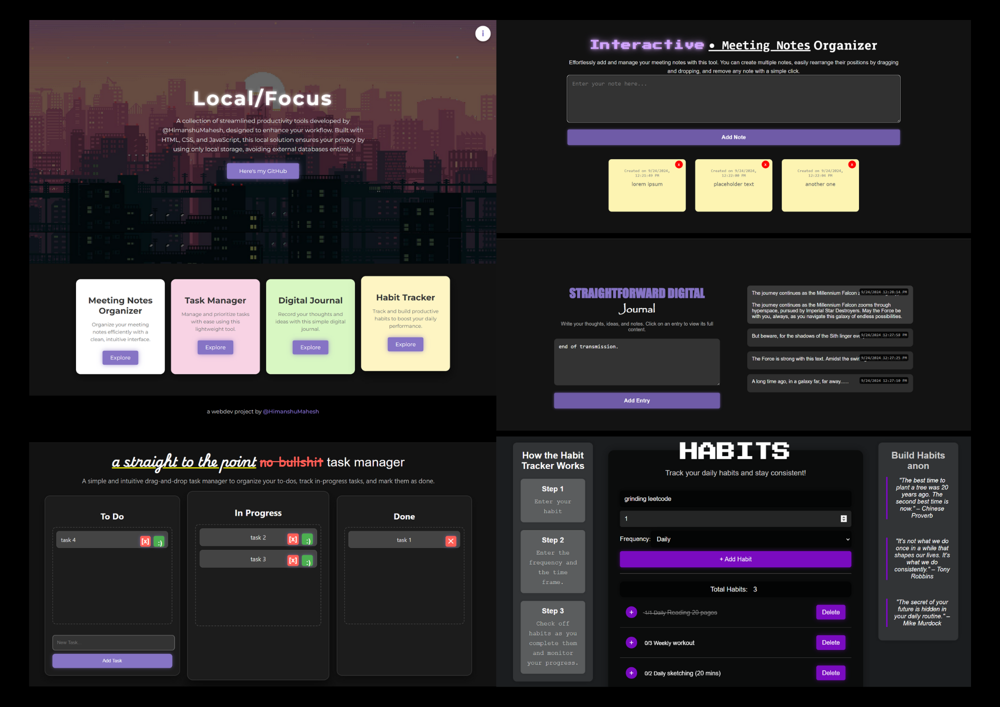

# LocalFocus

**LocalFocus** is a streamlined productivity suite I built using HTML, CSS, and JavaScript. It is designed to help you stay organized and focused with core productivity tools, all while ensuring your data remains local and private. By leveraging **local storage**, LocalFocus optimizes privacy by storing all user data directly in the browser—no external databases or servers required.

LocalFocus consists of four essential productivity applications that are integrated into a single, easy-to-use interface:

## Task Manager Web App

The **Task Manager Web App** is part of LocalFocus and provides an intuitive, drag-and-drop interface for organizing tasks. It helps you stay on top of your workload by allowing you to manage tasks across three primary categories: **To Do**, **In Progress**, and **Done**.

### Key Features:
- **Drag-and-Drop Interface**: Easily move tasks between categories.
- **Task Management**: Add new tasks, mark them as done, or delete them.
- **Task Persistence**: Tasks are saved locally in the browser using local storage, ensuring your data remains private.

## Note Wall Web App

The **Note Wall Web App** enables you to capture and manage notes in a stylish, visual format. Notes are displayed on a dynamic **Note Wall** with timestamps to help organize and reference them easily.

### Key Features:
- **Add Notes**: Quickly capture thoughts or ideas using the input area.
- **Note Wall**: A clean display that organizes and manages notes.
- **Drag-and-Drop**: Effortlessly rearrange notes as needed.
- **Timestamp Magic**: Each note displays its creation time for easy tracking.

## Habit Tracker Web App

The **Habit Tracker Web App** is designed to help you monitor and build positive habits. With a clean interface and motivational quotes, it makes tracking your daily progress more engaging and fun.

### Key Features:
- **Track Habits**: Monitor your daily progress and track multiple habits with ease.
- **Motivational Support**: Get inspired with motivational quotes that push you toward achieving your goals.

## Digital Journal Web App

The **Digital Journal Web App** lets you maintain a personal digital journal, combining playful and robotic design elements to create a unique writing experience. The app allows you to preview journal entries and manage them efficiently.

### Key Features:
- **Stylish Title**: The word "Digital" is styled with a robotic font, and "Journal" has a playful handwritten font for a unique visual experience.
- **Add Entries**: Enter your journal entries quickly and efficiently.
- **Preview Entries**: View a uniform preview of each entry before clicking to open.
- **Delete Entries**: Right-click on entries to access a dropdown menu and delete them when needed.

---

## Why "Local"?

LocalFocus keeps all your data stored **locally** within your browser's local storage, ensuring maximum privacy and security. This means:
- **No External Databases**: Your data is not sent or stored on any external servers.
- **Optimized Privacy**: Everything stays on your device, allowing you to focus on productivity without worrying about privacy concerns.
- **Offline Access**: Your data is accessible even when you're offline.

LocalFocus is a complete productivity suite that prioritizes simplicity, privacy, and functionality—perfect for staying organized and focused, all while maintaining control over your data.
